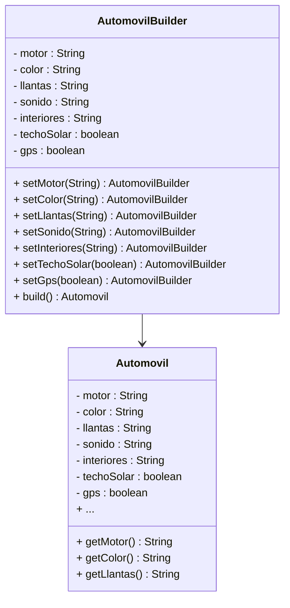
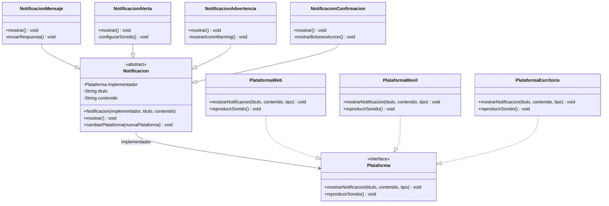

# 📘 Taller de Patrones de Diseño

### Integrantes
- Sofía Vargas Garzón
- Oscar David Vergara
- Juan David Moreno

## Ejercicio 1

**Tipo de patrón escogido:** Creacional

**Patrón de diseño escogido:** Build

Se escogió el patrón Builder porque permite crear un objeto complejo como un automóvil de forma clara y flexible, evitando constructores con muchos parámetros. De esta manera, el usuario puede personalizar solo las opciones que desee sin necesidad de usar todas, mejorando la legibilidad y manteniendo el objeto final inmutable.

### Diagrama de clases



## Ejercicio 2

**Patrón Estructural - Bridge (Puente)**

**¿Por qué Bridge?**
Separa la abstracción (tipos de notificación) de su implementación (plataformas)



#### Estructura del Patrón Bridge

```
Abstraction Hierarchy          Implementation Hierarchy
┌─────────────────┐           ┌──────────────────────┐
│   Notificacion  │◇─────────▶│     Plataforma       │
│   (abstract)    │           │    (interface)       │
└─────────────────┘           └──────────────────────┘
         │                              │
    ┌────┼────┐                    ┌────┼────┐
    │    │    │                    │    │    │
    ▼    ▼    ▼                    ▼    ▼    ▼
┌─────┐┌────┐┌─────┐        ┌──────┐┌──────┐┌──────┐
│Msj  ││Alrt││Warn │        │ Web  ││Movil ││Escrt │
└─────┘└────┘└─────┘        └──────┘└──────┘└──────┘
```

#### Estructura del Proyecto

```
📦 Ejercicio2/
├── 📄 Plataforma.java              # Interface base
├── 📄 PlataformaWeb.java           # Implementación Web
├── 📄 PlataformaMovil.java         # Implementación Móvil  
├── 📄 PlataformaEscritorio.java    # Implementación Escritorio
├── 📄 Notificacion.java            # Clase abstracta base
├── 📄 NotificacionMensaje.java     # Tipo Mensaje
├── 📄 NotificacionAlerta.java      # Tipo Alerta
├── 📄 NotificacionAdvertencia.java # Tipo Advertencia
├── 📄 NotificacionConfirmacion.java# Tipo Confirmación
└── 📄 SistemaNotificaciones.java   # Clase principal
```

#### Ejecución

```bash
# Compilar
javac *.java

# Ejecutar
java SistemaNotificaciones
```


## Ejercicio 3
